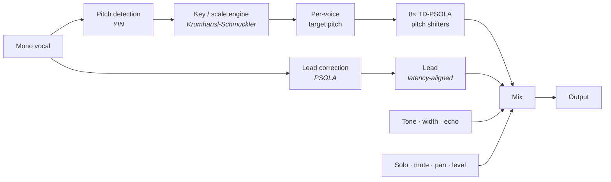
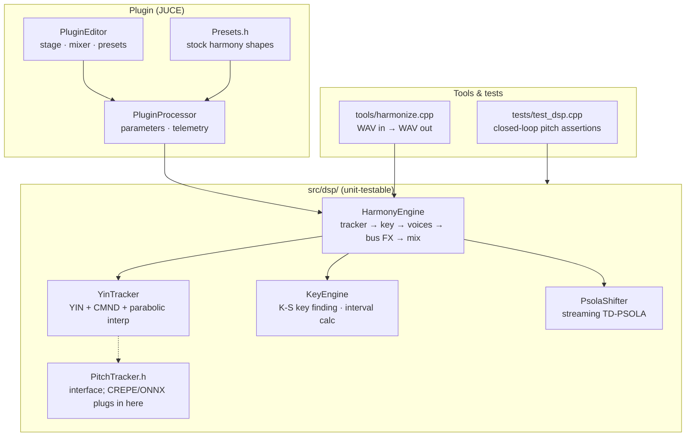

# Chorale

You sing one line. Chorale hands you the stack.

VST3, AU, and standalone on macOS, Windows, and Linux. Mono vocal in. Eight
harmonies out: diatonic stacks, pedal drones, MIDI-driven chords, pitch
correction, doubling. Time-domain PSOLA keeps the singer's throat instead of
turning them into a chipmunk.

## UI

Toggle **Stage**, **Mixer**, and **FX** in the header. Same eight voices,
three layouts.

**Stage** — drag voices on the radar for pan and gain. Voice chips up top,
detail panel for interval, detune, solo, and mute.


**Mixer** — all eight strips at once: mode, interval, detune, pan, mute/solo,
and dB faders with live meters. Right-click a fader to type a level.


**FX** — every voice's channel chain and the master chain as clickable module
cards. The EQ draws over a live spectrum; the compressor is a transfer-curve
graph with a gain-reduction meter.


## Download

Grab the latest zip for your OS from the repo **Releases** page (tags matching `v*`).
No compiler required. Unzip, copy the plugins in, rescan your DAW.

| Platform | Zip | Install to |
|----------|-----|------------|
| macOS | `Chorale-macOS.zip` | `.component` → `~/Library/Audio/Plug-Ins/Components/`, `.vst3` → `~/Library/Audio/Plug-Ins/VST3/`, `.app` anywhere |
| Windows | `Chorale-Windows.zip` | `.vst3` → `C:\Program Files\Common Files\VST3` |
| Linux | `Chorale-Linux.zip` | `.vst3` → `~/.vst3` |

### macOS warning (please read)

Release zips are **universal** (Apple Silicon + Intel) and **unsigned / not
notarized**. There is no paid Apple Developer Program membership on this
project, so Gatekeeper will treat a fresh download as untrusted. That is an
Apple policy / cost constraint — not malware, and nothing phone-home is
involved.

**Recommended:** run the installer. It is plain bash in this repo
([`scripts/install.sh`](scripts/install.sh)) — open it and read it before
piping if you want.

```sh
curl -fsSL https://raw.githubusercontent.com/rithulkamesh/chorale/master/scripts/install.sh | bash
```

Exactly what that script does, in order:

1. Hits the GitHub Releases API for the latest `v*` tag
2. Downloads `Chorale-macOS.zip` from `github.com/rithulkamesh/chorale`
3. Unzips into a temp directory
4. Clears the `com.apple.quarantine` xattr (so Gatekeeper stops blocking the
   bundles you just downloaded)
5. Ad-hoc codesigns with `codesign --force --deep -s -` (local signature only —
   **not** a Developer ID, **not** notarized, no Apple account used)
6. Copies into user-writable paths only (no `sudo`):
   - `~/Library/Audio/Plug-Ins/Components/Chorale.component`
   - `~/Library/Audio/Plug-Ins/VST3/Chorale.vst3`
   - `~/Applications/Chorale.app`
7. Deletes the temp directory on exit

It does **not** send telemetry, open a network connection except to GitHub, write
outside those three destinations, or request admin rights.

**Manual fallback:** download the zip yourself, then Right-click → **Open** on
each bundle (or allow under **System Settings → Privacy & Security**). Same
unsigned binaries; more clicking.

## Under the hood



Grains never get resampled. Formants stay put. That's the whole pitch-shift
story.

## Voices

Eight of them. Each picks a mode:

- **Scale** - diatonic interval from whatever you sang (2nd through octave, up
  or down), locked to the key so thirds land major or minor correctly
- **Note** - holds one pitch while you move. Alto pedals, drones, static pads
- **MIDI** - follows whatever you hold on a keyboard

Per voice: level, pan, detune (±50¢), solo, mute. Solo exists because auditioning
one harmony in a seven-voice wash is otherwise guesswork.

**Lead correction:** off, natural (partial snap, still musical), or hard (full
snap to scale).

**Humanize** adds slow, independent pitch drift and level flutter so the stack
reads as people, not a rack unit.

**Wet bus:** tone (low-pass), stereo width, ping-pong echo with feedback, and a
shared reverb bus.

**FX view:** each voice has a visible **chain** — `EQ → COMP → ECHO → VERB` —
shown as module cards. Click a card to edit it; click its power dot to bypass
it (EQ and compressor are opt-in and cost nothing while off). The EQ module is
a graphical **8-band EQ** (low shelf + six full-range peaks + high shelf; drag
nodes, double-click resets a band) drawn over a **live spectrum** of that
voice; COMP is a **transfer-curve graph** — drag the knee to set the
threshold, watch the input level ride the curve and the GR meter move — with
threshold/ratio knobs and auto makeup; ECHO/VERB are sends into the shared
echo and reverb buses. The master chain is `EQ → COMP → REVERB` on the main
mix. Mute/solo live in every view.

**MIDI adapt:** toggle **MIDI ADAPT** in the footer and every sounding
Scale/Note voice retunes to the nearest tone of whatever chord you hold on a
MIDI keyboard (live or from a MIDI track) — release the keys and the layers
fall back to their configured intervals. For fully MIDI-driven layers
(vocoder-style, each voice tracking a held note directly), set voices to
**MIDI** mode instead.

**Key:** auto-detect (Krumhansl-Schmuckler) or set root + mode yourself (major,
minor, church modes, chromatic). **33 presets** across duets, stacks, choirs,
octaves, doublers, pedals, MIDI, experimental. Apply one, then tear it apart.
Presets never touch your mix.

**User presets:** save, overwrite, and delete your own presets from the preset
menu (stored as plain XML in your user app-data folder). **A/B** buttons in the
footer swap between two full parameter states; **undo/redo** (⌘Z / ⇧⌘Z, or the
footer buttons) covers every knob move and preset apply.

**Latency:** two modes, switchable in the footer and reported to the host for
PDC. **Studio** is 2048 samples (~46 ms @ 44.1 kHz). **Live** halves it to 1024
(~23 ms) for tracking and performance — very low voices (below ~110 Hz) get
slightly rougher shifting there. AU passes `auval`.

**UI:** drag the corner to resize (50–200%); the scale is remembered per
session. IBM Plex Sans/Mono (OFL) is embedded, so the UI renders identically
everywhere.

**Updates:** on open, Chorale asks GitHub once (in the background) whether a
newer release exists; if so, a **Get vX.Y.Z** button appears in the footer —
click it and Chorale downloads the release zip for your platform straight to
`~/Downloads`, then reveals it. No telemetry, nothing sent — a single
releases-API read, and it fails silently offline.

## Multi-output

Besides the main stereo mix, Chorale exposes ten optional stereo buses:
**Lead** (the corrected, latency-aligned lead alone) and **Voice 1–8** (each
harmony voice post level/pan/solo/mute, pre wet-bus FX — process stems in
your DAW instead). All buses are disabled by default, so stereo sessions see
no change, and every bus shares the same latency, so stems stay sample-aligned
with the main out.

- **Logic**: insert the "Chorale (Multi-Output)" component, then click the
  **+** on the instrument channel strip to add aux channels per bus
- **Reaper**: FX pin editor → route plugin output pairs to track channels
- **Ableton Live**: extra audio tracks → *Audio From* → Chorale → pick a bus
- **Bitwig/Cubase**: enable the plugin's output buses in the routing panel

Stems follow the plugin mixer *and* each voice's FX chain: what you hear per
voice — EQ, compression, level, pan — is what the stem carries (sends stay on
the main mix).

## Demos

[`demos/`](demos/) has synthesized renders: `lead_dry.wav`,
`demo_harmony_diatonic.wav`, `demo_harmony_midi_chord.wav`.

The release zips include a standalone app. For batch rendering without a DAW,
use the `harmonize` CLI from a developer build (see below).

## Developing

Only needed if you are hacking on the code or running tests. Everyone else uses
Releases.

```sh
cmake -B build -DCMAKE_BUILD_TYPE=Release
cmake --build build
cmake --build build --target dsp_tests && ./build/dsp_tests
```

Offline renderer:

```sh
build/harmonize in.wav out.wav [dryWet] [key|auto] [scale|auto] [wetonly]
```

CMake 3.24+, C++20. JUCE fetches on configure. Linux also needs:

```sh
sudo apt-get install libasound2-dev libx11-dev libxext-dev libxrandr-dev \
  libxinerama-dev libxcursor-dev libfreetype6-dev libfontconfig1-dev libgl1-mesa-dev
```

### Code map



CI runs on every push ([`build.yml`](.github/workflows/build.yml)). Tag `v*`
to ship release zips on all platforms ([`release.yml`](.github/workflows/release.yml)).

## Roadmap

- CREPE pitch tracking via ONNX Runtime (weights bundled in release zips)
- World vocoder shift mode + formant knob
- Epoch-snapped PSOLA marks (bigger shift ratios)
- Tempo-synced echo, lower latency / configurable lookahead

## License

[AGPL-3.0](LICENSE). JUCE is AGPLv3 for open source, so we are too.
World vocoder (BSD-3) and ONNX Runtime (MIT) are on the radar. CREPE model
weights ship with official releases once that tracker lands; no separate
end-user download.
