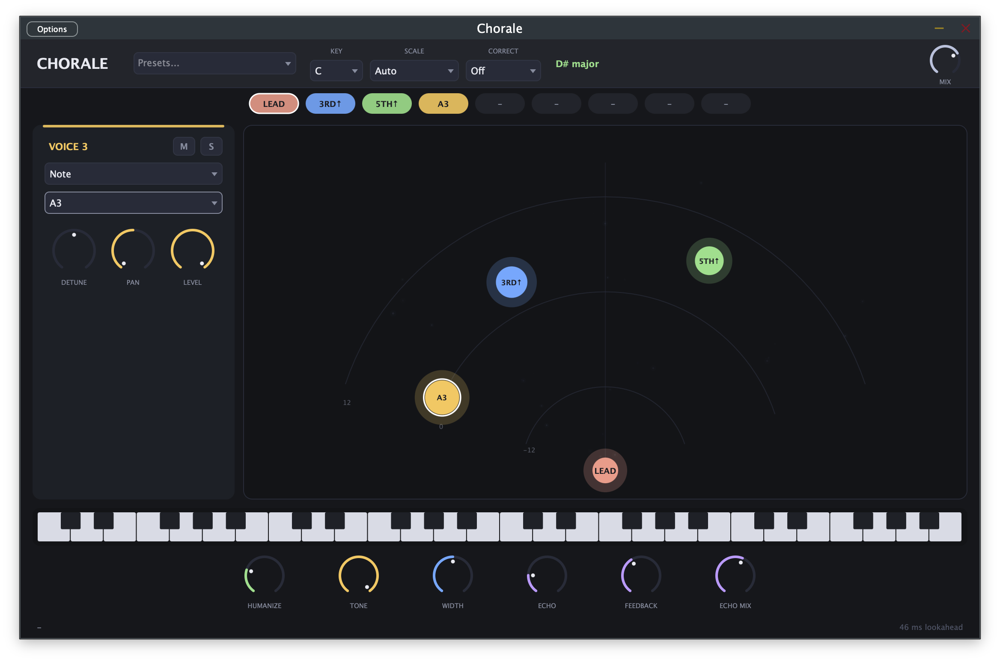
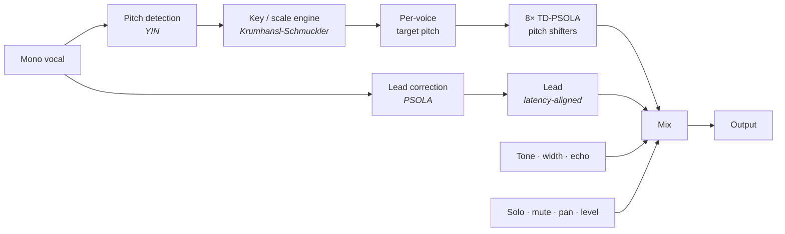
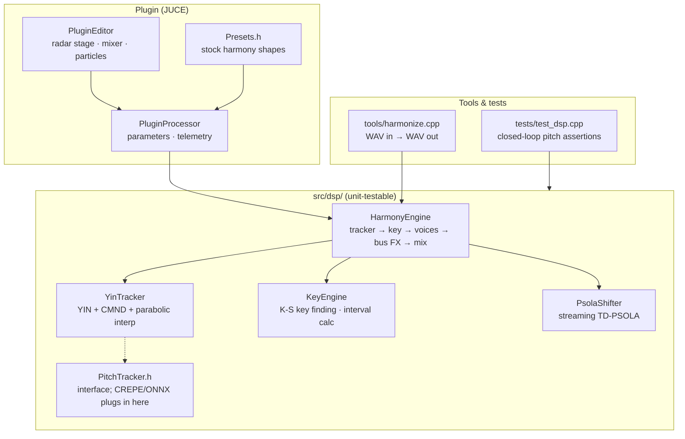

# Chorale

You sing one line. Chorale hands you the stack.

VST3, AU, and standalone on macOS, Windows, and Linux. Mono vocal in. Eight
harmonies out: diatonic stacks, pedal drones, MIDI-driven chords, pitch
correction, doubling. Time-domain PSOLA keeps the singer's throat instead of
turning them into a chipmunk.



## Download

Grab the latest zip for your OS from the repo **Releases** page (tags matching `v*`).
No compiler required. Unzip, copy the plugins in, rescan your DAW.

| Platform | Zip | Install to |
|----------|-----|------------|
| macOS | `Chorale-macOS.zip` | `.component` → `~/Library/Audio/Plug-Ins/Components/`, `.vst3` → `~/Library/Audio/Plug-Ins/VST3/`, `.app` anywhere |
| Windows | `Chorale-Windows.zip` | `.vst3` → `C:\Program Files\Common Files\VST3` |
| Linux | `Chorale-Linux.zip` | `.vst3` → `~/.vst3` |

macOS builds are universal (Apple Silicon + Intel) and **unsigned**. On first open,
macOS may block them. Right-click the plugin or app → **Open**, or allow in
**System Settings → Privacy & Security**. No Apple Developer account needed on
your end.

Future CREPE/ONNX pitch models ship **inside the release zip**, same as the
plugins. Users never fetch weights separately.

## Under the hood



Grains never get resampled. Formants stay put. That's the whole pitch-shift
story.

## Voices

Eight of them. Each picks a mode:

- **Scale** - diatonic interval from whatever you sang (2nd through octave, up
  or down), locked to the key so thirds land major or minor correctly
- **Note** - holds one pitch while you move. Alto pedals, drones, static pads
- **MIDI** - follows whatever you hold on a keyboard

Per voice: level, pan, detune (±50¢), solo, mute. Solo exists because auditioning
one harmony in a seven-voice wash is otherwise guesswork.

**Lead correction:** off, natural (partial snap, still musical), or hard (full
snap to scale).

**Humanize** adds slow, independent pitch drift and level flutter so the stack
reads as people, not a rack unit.

**Wet bus:** tone (low-pass), stereo width, ping-pong echo with feedback.

**Key:** auto-detect (Krumhansl-Schmuckler) or set root + mode yourself (major,
minor, church modes, chromatic). **33 presets** across duets, stacks, choirs,
octaves, doublers, pedals, MIDI, experimental. Apply one, then tear it apart.
Presets never touch your mix.

**UI:** radar stage for pan and level. **Mixer** view shows all eight gain faders
with dB markings, live meters, solo/mute. Right-click a fader to type a level.
Voice detail panel has the same dB fader plus detune and pan.

**Latency:** 2048 samples (~46 ms @ 44.1 kHz), reported to the host for PDC. AU
passes `auval`.

## Demos

[`demos/`](demos/) has synthesized renders: `lead_dry.wav`,
`demo_harmony_diatonic.wav`, `demo_harmony_midi_chord.wav`.

The release zips include a standalone app. For batch rendering without a DAW,
use the `harmonize` CLI from a developer build (see below).

## Developing

Only needed if you are hacking on the code or running tests. Everyone else uses
Releases.

```sh
cmake -B build -DCMAKE_BUILD_TYPE=Release
cmake --build build
cmake --build build --target dsp_tests && ./build/dsp_tests
```

Offline renderer:

```sh
build/harmonize in.wav out.wav [dryWet] [key|auto] [scale|auto] [wetonly]
```

CMake 3.24+, C++20. JUCE fetches on configure. Linux also needs:

```sh
sudo apt-get install libasound2-dev libx11-dev libxext-dev libxrandr-dev \
  libxinerama-dev libxcursor-dev libfreetype6-dev libfontconfig1-dev libgl1-mesa-dev
```

### Code map



CI runs on every push ([`build.yml`](.github/workflows/build.yml)). Tag `v*`
to ship release zips on all platforms ([`release.yml`](.github/workflows/release.yml)).

## Roadmap

- CREPE pitch tracking via ONNX Runtime (weights bundled in release zips)
- World vocoder shift mode + formant knob
- Epoch-snapped PSOLA marks (bigger shift ratios)
- Tempo-synced echo, lower latency / configurable lookahead

## License

[AGPL-3.0](LICENSE). JUCE is AGPLv3 for open source, so we are too.
World vocoder (BSD-3) and ONNX Runtime (MIT) are on the radar. CREPE model
weights ship with official releases once that tracker lands; no separate
end-user download.
