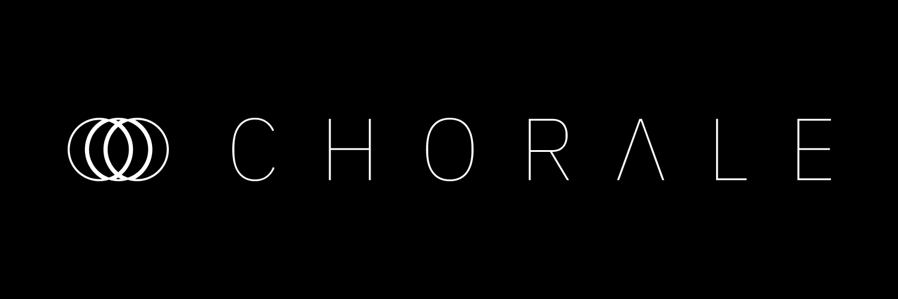
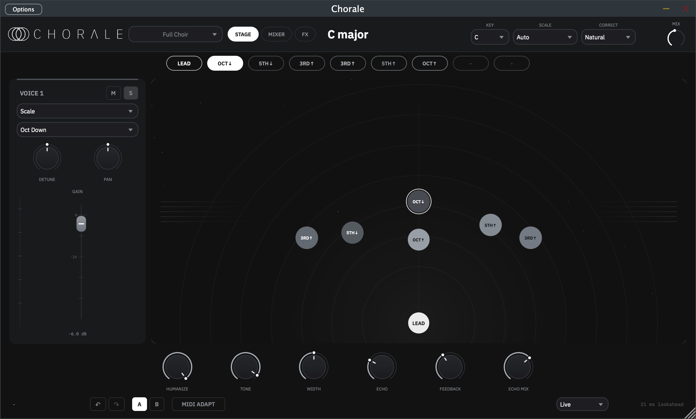
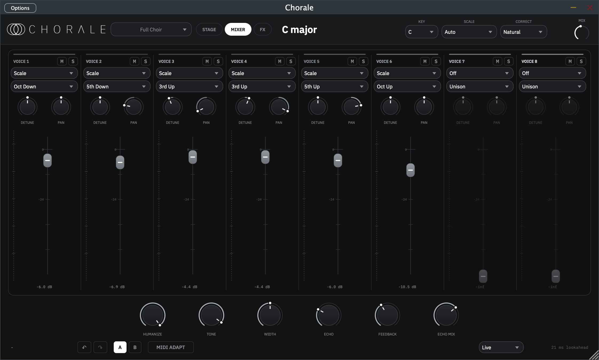
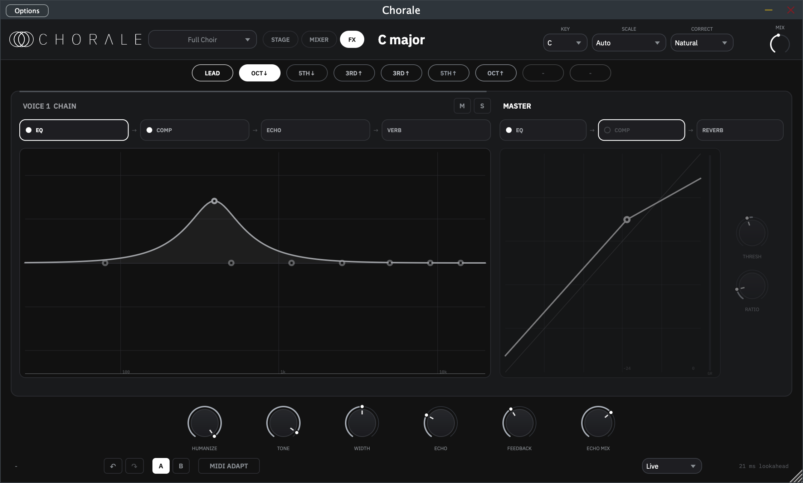
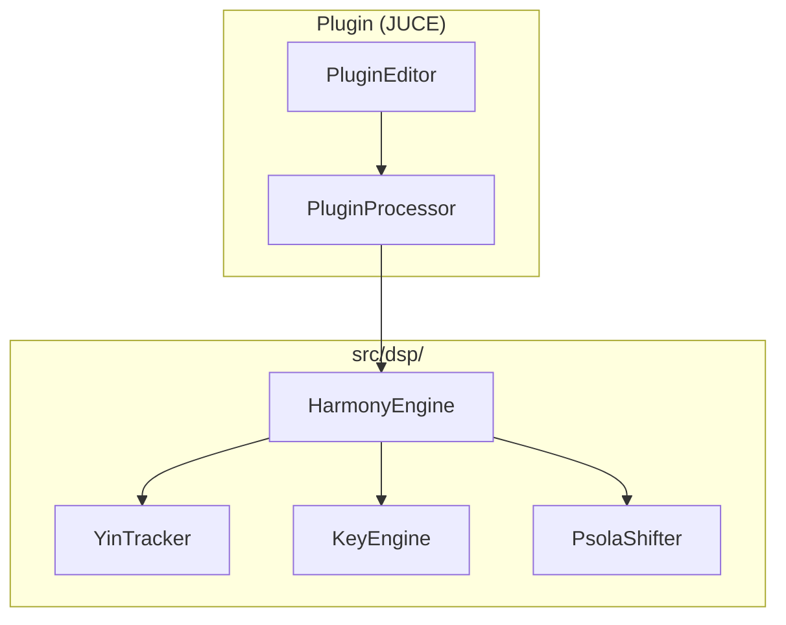

<p align="center">
  
</p>

<p align="center">
  You sing one line. Chorale hands you the stack.
</p>

VST3, AU, and standalone on macOS, Windows, and Linux. Mono vocal in, eight
harmonies out: diatonic stacks, pedal drones, MIDI chords, pitch correction,
doubling. Time-domain PSOLA keeps the singer's throat instead of turning them
into a chipmunk.

## Install

Grab a zip from **[Releases](https://github.com/rithulkamesh/chorale/releases)**
(`v*` tags). No compiler required.

| Platform | Zip | Install to |
|----------|-----|------------|
| macOS | `Chorale-macOS.zip` | see below |
| Windows | `Chorale-Windows.zip` | `.vst3` → `C:\Program Files\Common Files\VST3` |
| Linux | `Chorale-Linux.zip` | `.vst3` → `~/.vst3` |

### macOS (read this)

Builds are **universal** (Apple Silicon + Intel) and **unsigned / not
notarized**. There is no paid Apple Developer Program membership on this
project, so Gatekeeper treats a fresh download as untrusted. That is an Apple
policy / cost constraint, not malware. Nothing phones home.

**Recommended:** plain bash installer in this repo
([`scripts/install.sh`](scripts/install.sh)). Read it before piping if you want.

```sh
curl -fsSL https://raw.githubusercontent.com/rithulkamesh/chorale/master/scripts/install.sh | bash
```

What it does, in order:

1. Asks GitHub Releases for the latest `v*` tag
2. Downloads `Chorale-macOS.zip` from `github.com/rithulkamesh/chorale`
3. Unzips into a temp directory
4. Clears `com.apple.quarantine` (so Gatekeeper stops blocking the download)
5. Ad-hoc codesigns with `codesign --force --deep -s -` (local signature only:
   **not** a Developer ID, **not** notarized, no Apple account)
6. Copies into user paths only (no `sudo`):
   - `~/Library/Audio/Plug-Ins/Components/Chorale.component`
   - `~/Library/Audio/Plug-Ins/VST3/Chorale.vst3`
   - `~/Applications/Chorale.app`
7. Deletes the temp directory on exit

It does **not** send telemetry, talk to anything except GitHub, write outside
those three destinations, or ask for admin rights.

**Manual:** download the zip, then Right-click → **Open** on each bundle (or
allow under **System Settings → Privacy & Security**).

## UI

Toggle **Stage**, **Mixer**, and **FX** in the header. Same eight voices,
three layouts.

| Stage | Mixer | FX |
|:-----:|:-----:|:--:|
|  |  |  |
| Radar pan / gain | All eight strips | Per-voice + master chains |

## Features

- **8 voices:** Scale (diatonic interval), Note (pedal / drone), or MIDI
- **Lead correction:** off, natural, or hard snap to scale
- **Humanize:** independent pitch drift and level flutter
- **Patchable signal graph:** the FX view is a canvas — wire voices through a
  pool of EQ / COMP / SAT / GAIN / ECHO / REVERB nodes into OUT however you
  like. Every input sums (GAIN nodes are leveled summers), cables drag
  port-to-port, right-click cuts or adds nodes, and the graph rides in
  presets/A-B/undo. Echo and reverb are wireable nodes — share one across
  voices or give a voice its own; there are no send knobs. Old sessions
  migrate to an equivalent patch automatically
  ([design](docs/v1.2-signal-graph.md))
- **Node editors with live visuals:** spectrum-backed 8-band EQ, compressor
  transfer curve with GR meter, waveshaper curve, echo taps, reverb decay
- **Master chain:** fixed `EQ → COMP → SAT` on the main mix
- **MIDI adapt:** Scale/Note voices retune to a held MIDI chord; full MIDI mode
  for vocoder-style tracking
- **Key:** auto (Krumhansl-Schmuckler) or set root + mode
- **33 stock presets** plus user presets (XML in app-data). A/B, undo/redo
- **Latency:** Studio (2048 / ~46 ms) or Live (1024 / ~23 ms), reported for PDC
- **Multi-out:** Lead + Voice 1-8 stereo buses (disabled by default)
- **Updates:** silent GitHub Releases check on open; optional download to
  `~/Downloads`. No telemetry

## Demos

Synthesized renders (~3 s). GitHub has no inline audio player, so these are
small waveform `.mp4`s (unmute in the player). WAVs also live in
[`demos/`](demos/).

**Lead (dry)**

https://github.com/rithulkamesh/chorale/raw/master/demos/lead_dry.mp4

**Harmony · diatonic**

https://github.com/rithulkamesh/chorale/raw/master/demos/demo_harmony_diatonic.mp4

**Harmony · MIDI chord**

https://github.com/rithulkamesh/chorale/raw/master/demos/demo_harmony_midi_chord.mp4

## Developing

```sh
cmake -B build -DCMAKE_BUILD_TYPE=Release
cmake --build build
cmake --build build --target dsp_tests && ./build/dsp_tests
```

```sh
build/harmonize in.wav out.wav [dryWet] [key|auto] [scale|auto] [wetonly]
```

CMake 3.24+, C++20. JUCE fetches on configure. Linux also needs:

```sh
sudo apt-get install libasound2-dev libx11-dev libxext-dev libxrandr-dev \
  libxinerama-dev libxcursor-dev libfreetype6-dev libfontconfig1-dev libgl1-mesa-dev
```



CI: [`build.yml`](.github/workflows/build.yml). Tag `v*` to ship zips:
[`release.yml`](.github/workflows/release.yml).

## License

[AGPL-3.0](LICENSE). JUCE is AGPLv3 for open source, so we are too.
